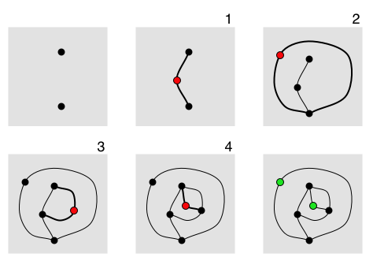

# sprouts  
[Sprouts](https://en.wikipedia.org/wiki/Sprouts_(game)) is a simple 3 rule game created by [John Horton Conway](https://en.wikipedia.org/wiki/John_Horton_Conway) and [Mike Paterson](https://en.wikipedia.org/wiki/Mike_Paterson). The game begins with some initial number of dots greater than 2 and players take turns connecting dots with lines. Each time a player draws a line, that player places a dot on that line. This implementation of the game allows users to play sprouts in ascii from the command line.  
## Rules  
 1. The must not touch or cross itself or any other line.  
 2. The new spot cannot be placed on top of one of the endpoints of the new line. Thus the new spot splits the line into two shorter lines.  
 3. No spot may have more than three lines attached to it. For the purposes of this rule, a line from the spot to itself counts as two attached lines and new spots are counted as having two lines already attached to them.  

